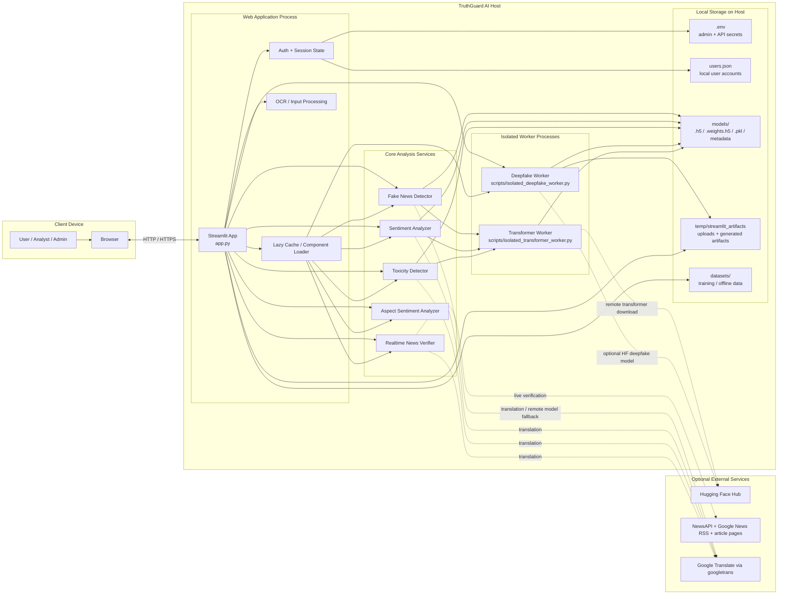

# TruthGuard_AI Deployment Diagram

This deployment view shows how the current project is typically arranged at runtime.
It focuses on deployed nodes, process boundaries, local storage, and optional external
services.

## Deployment Notes

- The app is deployed as a single primary Streamlit host process.
- Heavy deepfake and transformer inference run in separate subprocess workers so the main UI process remains stable.
- There is no relational database in the current project. Persisted auth data is stored in `users.json`.
- Local model files are loaded from `models/`, while temporary uploads and generated batch artifacts are written under `temp/streamlit_artifacts`.
- External connectivity is optional and is only needed for live news verification, translation, or downloading remote Hugging Face models.

## Basis in Code

- Streamlit app entrypoint and auth flow: `app.py`
- Local user store: `users.json`
- Deepfake subprocess boundary: `safe_deepfake_runtime.py`
- Transformer subprocess boundary: `safe_transformers.py`
- Live verification: `realtime_verifier.py`
- Translation helper: `translator_utils.py`
