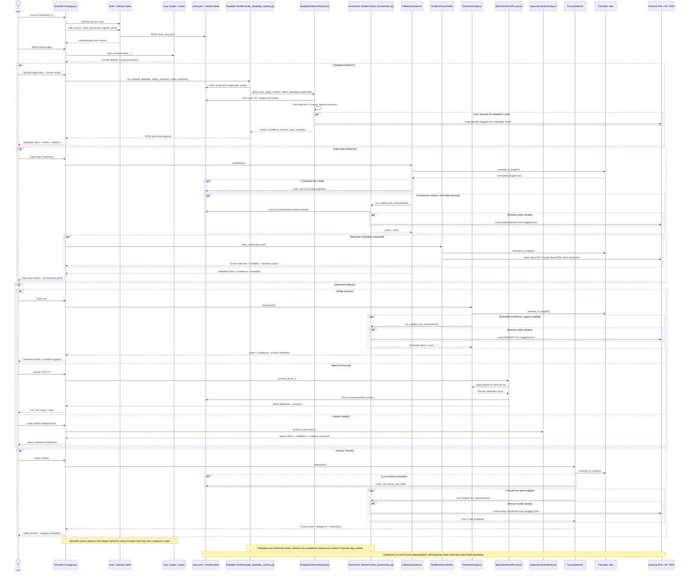

# TruthGuard_AI Sequence Diagram

This sequence diagram summarizes the end-to-end runtime flow of the full
TruthGuard_AI application, based on the current codebase.

```mermaid
sequenceDiagram
    actor User
    participant UI as Streamlit UI\n(app.py)
    participant Auth as Auth + Session State
    participant Cache as Lazy Loader / Cache
    participant DB as users.json + temp/models
    participant DW as Deepfake Worker\n(safe_deepfake_runtime.py)
    participant DD as DeepfakeDetectorAdvanced
    participant TW as Transformer Worker\n(safe_transformers.py)
    participant FN as FakeNewsDetector
    participant RV as RealtimeNewsVerifier
    participant SA as SentimentAnalyzer
    participant BP as BatchSentimentProcessor
    participant AA as AspectSentimentAnalyzer
    participant TX as ToxicityDetector
    participant TR as Translator Utils
    participant EXT as External APIs / HF / RSS

    User->>UI: Launch TruthGuard_AI
    UI->>Auth: Initialize session state
    UI->>Auth: load_users(), verify_password(), register_user()
    Auth->>DB: Read / write users.json
    Auth-->>UI: Authenticated user session

    User->>UI: Select feature page
    UI->>Cache: load_component(get_...)
    Cache-->>UI: Cached detector / analyzer instance

    alt Deepfake Detection
        User->>UI: Upload image/video + choose model
        UI->>DW: run_isolated_deepfake_image_analysis() / video_analysis()
        DW->>DB: Store temporary image/video artifact
        DW->>DD: detect_with_single_model() / detect_deepfake_ensemble()
        DD->>DB: Scan local .h5 / .weights.h5 models
        DD->>DD: Face detection + forensic feature extraction
        opt User selected HF deepfake model
            DD->>EXT: Load selected Hugging Face deepfake model
        end
        DD-->>DW: Verdict, confidence, forensic maps, metadata
        DW-->>UI: JSON-safe result payload
        UI-->>User: Deepfake report + charts + evidence
    end

    alt Fake News Detection
        User->>UI: Enter claim / article text
        UI->>FN: predict(text)
        FN->>TR: translate_to_english()
        TR-->>FN: Normalized English text
        opt Traditional ML model
            FN->>DB: Load / use local sklearn pipeline
        end
        opt Transformer model or HF model selected
            FN->>TW: run_isolated_text_classification()
            TW->>DB: Load local transformer assets if present
            opt Remote model needed
                TW->>EXT: Load model/tokenizer from Hugging Face
            end
            TW-->>FN: Label + score
        end
        opt Real-time verification requested
            UI->>RV: verify_claim(claim_text)
            RV->>TR: translate_to_english()
            RV->>EXT: Query NewsAPI / Google News RSS / fetch article text
            RV-->>UI: Source matches + credibility + similarity scores
        end
        FN-->>UI: Fake/Real label + confidence + metadata
        UI-->>User: Fake news verdict + live evidence panel
    end

    alt Sentiment Analysis
        alt Single Analysis
            User->>UI: Enter text
            UI->>SA: analyze(text)
            SA->>TR: translate_to_english()
            opt Ensemble transformer support enabled
                SA->>TW: run_isolated_text_classification()
                opt Remote model needed
                    TW->>EXT: Load DistilBERT from Hugging Face
                end
                TW-->>SA: Sentiment label + score
            end
            SA-->>UI: Label + confidence + emotion metadata
            UI-->>User: Sentiment panel + confidence gauge
        else Batch Processing
            User->>UI: Upload CSV/TXT
            UI->>BP: process_texts(...)
            BP->>SA: analyze(text) for each record
            SA-->>BP: Per-text sentiment result
            BP->>DB: Save compressed batch artifact
            BP-->>UI: Batch dataframe + summary
            UI-->>User: Pie / bar charts + table
        else Aspect Insights
            User->>UI: Enter review / feedback text
            UI->>AA: analyze_aspects(text)
            AA-->>UI: Aspect labels + confidence + evidence sentences
            UI-->>User: Aspect sentiment breakdown
        end
    end

    alt Toxicity Checker
        User->>UI: Enter content
        UI->>TX: predict(text)
        TX->>TR: translate_to_english()
        opt Local sklearn ensemble
            TX->>DB: Load / use toxicity .pkl model
        end
        opt Transformer path enabled
            TX->>TW: run_isolated_text_classification()
            opt Remote model needed
                TW->>EXT: Load toxicity transformer from Hugging Face
            end
            TW-->>TX: Toxic / safe probability
        end
        TX-->>UI: Toxicity score + categories + explanation
        UI-->>User: Safety verdict + category breakdown
    end

    Note over UI,Cache: Streamlit caches detectors and helpers lazily\nso heavy modules load only when a feature is used.
    Note over DW,TW: Deepfake and transformer-heavy inference are isolated\nin subprocess workers to prevent app crashes.
    Note over DB,EXT: TruthGuard_AI mixes local models/artifacts with\noptional online verification and model downloads.
```

