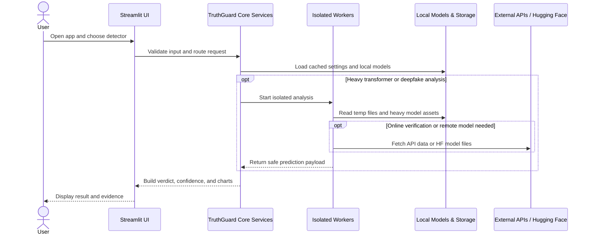

# TruthGuard_AI Simplified Sequence Diagram

This is a simplified, high-level version of the TruthGuard_AI runtime flow.
It groups the detailed detectors into a few major runtime components so the
overall behavior is easier to present in reports and documentation.

Covered modules:
- Deepfake detection
- Fake news detection
- Sentiment analysis
- Toxicity detection
